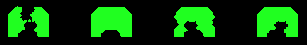

# Space Invaders Clone
This project has been initiated to get practice in python programming by implementing the famous Arcade game "Space Invaders".

    

## Game Control
| Key | Action |
|-----|-----|
| Arrow Left | Move ship left |
| Arrow Right | Move ship right |
| Space | Fire |

## Implementation
The project started with the **Turtle graphics** implementation as this is an easy way to get started with a graphical user-interface (GUI) in python.
It took some days to get the implementation playable - so that it makes fun.
Then the question arose if it wouldn't be easier to use another graphics bundle for a python game.
**pygame** was self-evident for this trial.
Of course it took some time to dive into pygame to get the first game running. But it was worth the effort. - There will be further games with pygame...

The folder structure was chosen to hold the code for **Turtle graphics** and **pygame** in parallel - allowing easy comparison of the two implementations.
The graphics elements used are located in the common folder *resources*.

### Techniques
- When a shot hits an alien, the alien becomes invisible. The dectection of a collision is only done with visible objects.
Shots run through invisible objects.
- There is no infinite number of available shots. Shot objects are kept inside shot buffers.
And it is avoided to destroy a shot object and generate a new one afterwards. Shot objects are reused after they hit some other object or disappear from screen.

## Differences in the Graphics Bundles

| Turtle graphics | pygame |
|-----|-----|
| center based coordinate system | top left corner is (0, 0), visible area uses pos. values |
| only turtle changes are redrawn on screen | redraws always the full screen |
| only works with graphics in gif-format | supports various formats |
| attribute for visibility is intrinsic using a turtle object (see isvisible(), hideturtle()) | Visibility attribute needs to be implemented manually if needed. |
| To measure the distance between two turtle objects the built-in method distance() can be used.| A rectangle object needs to be created for a graphics element in order to move an object. Measurement of distance has to be implemented manually.|
| Distance is always measured from the center of an object. | Every edge or corner of the rectangle can be referenced for measurement - and the center! |
| Screen object has to be passed to other modules for width/height awareness. | User modules can access screen properties. |
| event handler outside of game-loop | event handler inside game-loop |

## TODOs
- [ ] Add 4 protective barriers where the ship can hide! 
As a barrier will be destroyed in chunks by shots from the ship and from the aliens this implementation is quite a complex task:
A barrier must be a cluster of small objects that will become invisible when hit by a shot.
For collision detection it has to be iterated through all shots (from ship, from the array of aliens and from the mystery object) and through all graphic elements in all 4 barriers.

    

## Conclusion
Turtle graphics gives the developer a good start in graphics programming. It's impressing what You can do with this bundle (see <a href="https://docs.python.org/3/library/turtle.html#module-turtledemo">turtledemo</a>)! 
However every graphics object on screen must be a turtle object which by default draws a turtle on screen and leaves a line when it is moved.
This causes an overhead - also in additional code lines! On the other hand Turtle graphics offers e.g. the built-in method distance(), which is useful for detection of a collision. 
The pygame solution uses graphical methods which are also used by professionals.
Simple objects like e.g. a line only require one line of code. Diving into each graphics bundle requires some time. 
**Should You plan to develop several games using python, pygame might be the better choice for You!**

## Sources
- The gif-files have been taken from [Wikipedia](https://en.wikipedia.org/wiki/Space_Invaders)
- <a href="https://docs.python.org/3/library/turtle.html#">Turtle graphics documentation</a>
- <a href="https://www.pygame.org/docs/">pygame documentation</a>
